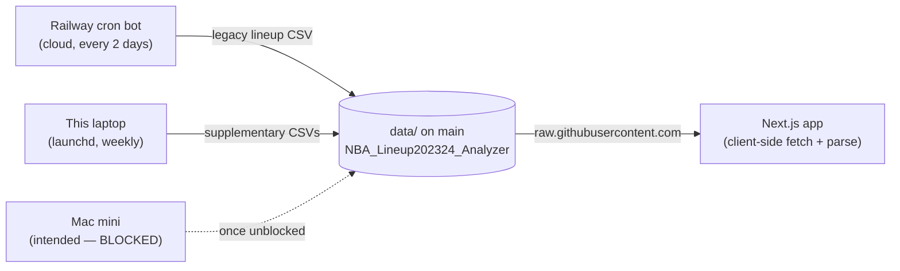

# Data sources & publishing

How NBA data gets from `stats.nba.com` into the web app. There are **two repos**, **two
automated producers** (plus one intended third), and the frontend reads everything as
static CSVs over GitHub's raw CDN — there is no API server or database.

## The two repos

| Repo | What it is |
|------|------------|
| [`meharpalbasi/nbalineup`](https://github.com/meharpalbasi/nbalineup) | The Next.js web app (frontend). |
| [`meharpalbasi/NBA_Lineup202324_Analyzer`](https://github.com/meharpalbasi/NBA_Lineup202324_Analyzer) | **This repo**: the Python pipeline **and** the published CSVs in `data/`. The frontend fetches its raw URLs. |

## Flow

## Who produces what

| Data file (in `data/`) | Producer | nba_api endpoint | Published to git? |
|---|---|---|---|
| `NBALineup202526_RegSeason_Playoffs_BaseAdvanced.csv` | **Railway** | `TeamDashLineups` (5-man) | ✅ |
| `on_off_2025-26.csv` | **Laptop** | `TeamPlayerOnOffSummary` | ✅ |
| `clutch_2025-26.csv` | **Laptop** | `LeagueDashTeamClutch` | ✅ |
| `play_types_2025-26.csv` | **Laptop** | `SynergyPlayTypes` | ✅ |
| `tracking_2025-26.csv` | **Laptop** | `LeagueDashPtStats` | ✅ |
| `defense_tracking_2025-26.csv` | **Laptop** | `LeagueDashPtDefend` | ✅ |
| `hustle_players_2025-26.csv`, `hustle_teams_2025-26.csv` | **Laptop** | `LeagueHustleStats*` | ✅ |
| `estimated_metrics_2025-26.csv` | **Laptop** | `PlayerEstimatedMetrics` | ✅ |
| `lineups_slim_2man_2025-26.csv`, `lineups_slim_3man_2025-26.csv` | **Laptop** | `TeamDashLineups` (slim) | ✅ |
| `lineups_5man/3man/2man_2025-26.csv` (full) | Laptop (full run) | `TeamDashLineups` | ❌ `.gitignore`d (too big) |
| `NBALineup202425_…`, `NBALineup202324_…` | one-off historical | `TeamDashLineups` | ✅ (static) |

## Producer 1 — Railway (cloud), every 2 days

- Config: [`railway.json`](../railway.json) → `cronSchedule: "0 0 */2 * *"` = **00:00 UTC every 2 days**, `startCommand: bash update_and_commit.sh`.
- [`update_and_commit.sh`](../update_and_commit.sh): sync `main` → `python fetchlineups.py` → `git add data/` → commit `chore: update NBA lineup data - <date>` → push.
- Output: the **legacy 5-man lineup CSV** for the current season only.
- Keep-alive: [`.github/workflows/railway-keepalive.yml`](../.github/workflows/railway-keepalive.yml) pings Railway to redeploy **every Sunday 00:00 UTC** so the free-tier service doesn't sleep.
- ⚠️ Caveat: since ~Feb 2026, `stats.nba.com` (Akamai) throttles/blocks datacenter IPs, so the cloud lineup fetch can be flaky. The residential machine below is the dependable publisher. See [`docs/MINI_NBA_BLOCK_DEBUG.md`](./MINI_NBA_BLOCK_DEBUG.md).

## Producer 2 — This laptop (launchd), Mondays 08:00 local

- Config: [`scripts/com.nbalineup.supplementary.plist`](../scripts/com.nbalineup.supplementary.plist) → `StartCalendarInterval` Weekday 1 (Monday), 08:00. If the machine is asleep, launchd runs it on next wake.
- [`scripts/run_supplementary.sh`](../scripts/run_supplementary.sh): pull `main` → `python -m pipeline.main --supplementary-only` (~220 API calls) → stage the rich CSVs → commit `data: refresh supplementary stats - <date>` → push (only if something changed).
- Output: **everything databallr-style** — on/off, clutch, play types, tracking, defense tracking, hustle, estimated metrics, and the **slim 2/3-man lineups**.
- Why residential: it routes nba_api through `curl_cffi` (Chrome TLS impersonation) from a home IP, which `stats.nba.com` accepts. See [`pipeline/nba_http_patch.py`](../pipeline/nba_http_patch.py).
- **This is the active supplementary publisher today** (the Mac mini is blocked — see below).

## Producer 3 — Mac mini (intended, currently BLOCKED)

- The same job ([`scripts/com.nbalineup.supplementary.mini.plist`](../scripts/com.nbalineup.supplementary.mini.plist), Mondays 08:00) is *meant* to run on the always-on Mac mini so the laptop doesn't have to — especially for future heavy pulls (e.g. shot charts).
- It currently **times out on `stats.nba.com` only** (raw TCP connects, but the TLS handshake carrying `SNI=stats.nba.com` is silently dropped). Leading hypothesis: home-router per-device (MAC) filtering. Decisive cheap test: run the connectivity check on a phone hotspot.
- Full debug notes + next steps: [`docs/MINI_NBA_BLOCK_DEBUG.md`](./MINI_NBA_BLOCK_DEBUG.md). One-time setup once fixed: [`scripts/SETUP_MACMINI.md`](./SETUP_MACMINI.md).

## How the frontend consumes it

- URLs live in the app at `lib/seasons-config.js`, all pointing at
  `https://raw.githubusercontent.com/meharpalbasi/NBA_Lineup202324_Analyzer/main/data/<file>.csv`.
- The app fetches the CSV client-side, parses it in the browser, and renders. No backend API, no database.

| Page | File(s) read |
|------|--------------|
| `/dashboard` (5-man) | `NBALineup{season}_…BaseAdvanced.csv` |
| `/dashboard` (3/2-man) | `lineups_slim_3man/2man_*.csv` |
| `/wowy` | `on_off_*.csv` |
| `/clutch` | `clutch_*.csv` |
| `/playtypes` | `play_types_*.csv` |
| (planned `/players`, `/teams`) | tracking / estimated / hustle / play types / new pulls |

## Seasons

- **2025-26** — current: legacy lineups (Railway) + full supplementary (laptop).
- **2024-25, 2023-24** — historical: legacy 5-man lineup CSVs only (no supplementary).

## Operating notes

- **Publish supplementary data now (manually):** on a residential machine, `bash scripts/run_supplementary.sh` (commits + pushes only if data changed).
- **Change a schedule:** Railway → edit `cronSchedule` in `railway.json`; laptop/mini → edit `StartCalendarInterval` in the plist, then `launchctl unload && launchctl load` it.
- **Confirm a run happened:** look for the commit messages above on `main`, or tail `scripts/logs/launchd.{out,err}.log`.
- **Only one residential publisher at a time:** if the mini is ever fixed, remove the laptop's LaunchAgent so the two don't race (see the MINI debug doc, "Once fixed").

## See also
- [`RAILWAY_SETUP.md`](../RAILWAY_SETUP.md) — Railway deploy + env vars.
- [`scripts/SETUP_MACMINI.md`](./SETUP_MACMINI.md) — residential publisher setup.
- [`docs/MINI_NBA_BLOCK_DEBUG.md`](./MINI_NBA_BLOCK_DEBUG.md) — the Mac mini block investigation.
