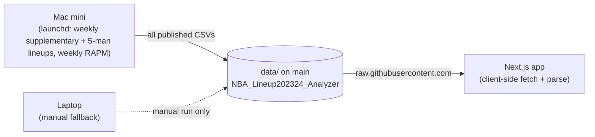

# Data sources & publishing

How NBA data gets from `stats.nba.com` into the web app. There are **two repos**, **one
automated producer** (the Mac mini at home), and the frontend reads everything as static
CSVs over GitHub's raw CDN — there is no API server or database.

## The two repos

| Repo | What it is |
|------|------------|
| [`meharpalbasi/nbalineup`](https://github.com/meharpalbasi/nbalineup) | The Next.js web app (frontend). |
| [`meharpalbasi/NBA_Lineup202324_Analyzer`](https://github.com/meharpalbasi/NBA_Lineup202324_Analyzer) | **This repo**: the Python pipeline **and** the published CSVs in `data/`. The frontend fetches its raw URLs. |

## Flow

```mermaid
flowchart LR
  M["Mac mini<br/>(launchd: weekly supplementary + 5-man lineups, weekly RAPM)"]
  L["Laptop<br/>(manual fallback)"]
  D[("data/ on main<br/>NBA_Lineup202324_Analyzer")]
  F["Next.js app<br/>(client-side fetch + parse)"]
  M -->|all published CSVs| D
  L -. manual run only .-> D
  D -->|raw.githubusercontent.com| F
```

> **Railway is retired (2026-09).** A Railway cron used to publish the legacy 5-man lineup
> CSV every 2 days. `stats.nba.com` throttles datacenter IPs, so it missed most runs from
> mid-July 2026 on; the fetch was ported into the pipeline (`--legacy-lineups-only`) and the
> Mac mini publishes that file too. See [Retiring Railway](#retiring-railway-checklist) below.

## Who produces what

| Data file (in `data/`) | Producer | nba_api endpoint | Published to git? |
|---|---|---|---|
| `NBALineup202526_RegSeason_Playoffs_BaseAdvanced.csv` (legacy 5-man, current season) | **Mac mini** (`--legacy-lineups-only`) | `TeamDashLineups` (5-man, Base+Adv, Totals) | ✅ |
| `on_off_2025-26.csv` | **Mac mini** | `TeamPlayerOnOffSummary` | ✅ |
| `clutch_2025-26.csv` | **Mac mini** | `LeagueDashTeamClutch` | ✅ |
| `play_types_2025-26.csv` | **Mac mini** | `SynergyPlayTypes` | ✅ |
| `tracking_2025-26.csv` | **Mac mini** | `LeagueDashPtStats` | ✅ |
| `defense_tracking_2025-26.csv` | **Mac mini** | `LeagueDashPtDefend` | ✅ |
| `hustle_players_2025-26.csv`, `hustle_teams_2025-26.csv` | **Mac mini** | `LeagueHustleStats*` | ✅ |
| `estimated_metrics_2025-26.csv` | **Mac mini** | `PlayerEstimatedMetrics` | ✅ |
| `player_stats_2025-26.csv` | **Mac mini** | `LeagueDashPlayerStats` (Base+Adv) | ✅ |
| `team_stats_2025-26.csv` | **Mac mini** | `LeagueDashTeamStats` (Base+Adv+4F) | ✅ |
| `player_clutch_2025-26.csv` | **Mac mini** | `LeagueDashPlayerClutch` | ✅ |
| `shot_zones_2025-26.csv` | **Mac mini** | `LeagueDashPlayerShotLocations` | ✅ |
| `player_game_logs_2025-26.csv` | **Mac mini** | `LeagueGameLog` (player) | ✅ |
| `team_game_logs_2025-26.csv` | **Mac mini** | `LeagueGameLog` (team) | ✅ |
| `pt_shot_defender_2025-26.csv` | **Mac mini** | `LeagueDashPlayerPtShot` | ✅ |
| `player_index_2025-26.csv` | **Mac mini** (computed) | join of player_stats + on/off + clutch + **BPM/VORP** + **shot-making** (+ **RAPM**), no new pull | ✅ |
| `rapm_2025-26.csv` | **`run_rapm.sh`** (residential, ~1h) | `playbyplayv3` + `boxscoretraditionalv3` → lineup reconstruction → ridge | ✅ |
| `lineups_slim_2man_2025-26.csv`, `lineups_slim_3man_2025-26.csv` | **Mac mini** | `TeamDashLineups` (slim) | ✅ |
| `lineups_5man/3man/2man_2025-26.csv` (full) | Mac mini (full run) | `TeamDashLineups` | ❌ `.gitignore`d (too big) |
| `NBALineup202425_…`, `NBALineup202324_…` | one-off historical | `TeamDashLineups` | ✅ (static) |

**Computed offline (no new API calls):** BPM 2.0 + VORP and shot-making/xeFG are
derived from the pulls above by `pipeline/compute_impact.py` and merged into
`player_index` by `pipeline/export_web.py`. **RAPM** is the one exception that
needs a new (heavy) pull — its own play-by-play subsystem, below.

## Producer 1 — Mac mini (launchd), Mondays 08:00 local — **the publisher**

- Config: [`scripts/com.nbalineup.supplementary.mini.plist`](../scripts/com.nbalineup.supplementary.mini.plist), installed on the mini as `~/Library/LaunchAgents/com.nbalineup.supplementary.plist` → `StartCalendarInterval` Weekday 1 (Monday), 08:00. Runs on next wake if asleep.
- [`scripts/run_supplementary.sh`](../scripts/run_supplementary.sh): pull `main` → `python -m pipeline.main --supplementary-only` (~220 API calls) → `python -m pipeline.main --legacy-lineups-only` (~120 calls, separate invocation so one can't sink the other) → stage the published CSVs → commit `data: refresh supplementary stats - <date>` → push (only if something changed).
- Output: **everything databallr-style** — on/off, clutch, play types, tracking, defense tracking, hustle, estimated metrics, the **slim 2/3-man lineups** — **plus the legacy 5-man lineup CSV** the dashboard reads.
- The legacy fetch (`pipeline/fetch_lineups.py::fetch_legacy_lineups`) writes a byte-identical file when nothing changed and refuses to overwrite a complete table with a partial one, so a flaky run never publishes a half-empty dashboard.
- Why residential: it routes nba_api through `curl_cffi` (Chrome TLS impersonation) from a home IP, which `stats.nba.com` accepts. See [`pipeline/nba_http_patch.py`](../pipeline/nba_http_patch.py).
- Setup runbook: [`scripts/SETUP_MACMINI.md`](../scripts/SETUP_MACMINI.md). (The mini was briefly mis-diagnosed as "blocked" — that was a test-command false negative; see [`docs/MINI_NBA_BLOCK_DEBUG.md`](./MINI_NBA_BLOCK_DEBUG.md).)

### Optional — mid-week 5-man refresh (`run_lineups.sh`, Wed + Fri)

- [`scripts/run_lineups.sh`](../scripts/run_lineups.sh) + [`scripts/com.nbalineup.lineups.mini.plist`](../scripts/com.nbalineup.lineups.mini.plist): the `--legacy-lineups-only` step on its own, Wednesdays and Fridays 08:00. With Monday's job that is the every-2-days cadence Railway had. **Not loaded by default** — load it if weekly lineups feel stale in-season. Commit `data: refresh 5-man lineups - <date>`, only when the file changed.

## Producer 1b — RAPM (`run_rapm.sh`, residential, separate cadence)

- [`scripts/run_rapm.sh`](../scripts/run_rapm.sh): pull `main` → `python -m pipeline.main --rapm-only` → stage `rapm_*.csv` + the refreshed `player_index_*.csv` → commit `data: refresh RAPM - <date>` → push.
- Heavy and **separate from the weekly supplementary run**: it reconstructs every game's on-court fives from `playbyplayv3` + `boxscoretraditionalv3` (no pre-built lineup feed exists for the current season), so it's ~2,500 light per-game calls / ~1h. Run it on its own slower cadence.
- Raw play-by-play JSON is cached under `data/rapm_cache/` (gitignored), so a re-run only fetches games it hasn't seen.
- Residential IP only, same `curl_cffi` reason as the supplementary fetch.
- Recipe + gotchas live in the [`pipeline/fetch_rapm.py`](../pipeline/fetch_rapm.py) module docstring.

## Producer 2 — Laptop (manual fallback)

- Same repo + venv as the mini; can publish on demand with `bash scripts/run_supplementary.sh` (which includes the 5-man file) or just `bash scripts/run_lineups.sh`.
- Its **scheduled** LaunchAgent has been **retired** (`launchctl unload …`) so it doesn't race the mini. Re-enable with `launchctl load -w …` if the mini is ever offline for a while.

## How the frontend consumes it

- URLs live in the app at `lib/seasons-config.js`, all pointing at
  `https://raw.githubusercontent.com/meharpalbasi/NBA_Lineup202324_Analyzer/main/data/<file>.csv`.
- The app fetches the CSV client-side, parses it in the browser, and renders. No backend API, no database.

| Page | File(s) read |
|------|--------------|
| `/dashboard` (5-man) | `NBALineup{season}_…BaseAdvanced.csv` |
| `/dashboard` (3/2-man) | `lineups_slim_3man/2man_*.csv` |
| `/wowy` | `on_off_*.csv` |
| `/clutch` | `clutch_*.csv` |
| `/playtypes` | `play_types_*.csv` |
| `/players` (table) | `player_index_*.csv` (incl. BPM/VORP, shot-making, **RAPM**) |
| `/players/[id]` (profile) | `player_index_*` + `player_stats_*` + `shot_zones_*` + `player_game_logs_*` + `defense_tracking_*` + `hustle_players_*` + `tracking_*` + `pt_shot_defender_*` |
| `/teams` | `team_stats_*` + `team_game_logs_*` |

## Seasons

- **Current season = derived from the date** (`pipeline/season.py`, rolls over **1 October**;
  `NBA_SEASON` overrides). Nobody edits a season string in October: from 1 Oct every producer
  targets the new season, gets 0 rows until opening night (every fetcher skips writing empty
  files, so those runs are no-ops), and starts publishing `*_<new season>.csv` the first run after
  games are played. The frontend switches over on its own once the new season's `player_index`
  and 5-man files exist (see the frontend's `lib/current-season.js`).
- **2017-18 → 2024-25** — historical, backfilled in full (5/3/2-man lineups + supplementary +
  RAPM/IPM); the 2023-24/2024-25 5-man tables are the legacy `NBALineup…` files, older seasons use
  `lineups_5man_<season>.csv`.

## Operating notes

- **Publish supplementary data now (manually):** on a residential machine, `bash scripts/run_supplementary.sh` (commits + pushes only if data changed). Just the 5-man file: `bash scripts/run_lineups.sh`.
- **Health check (NOT a bare curl one-liner):** `python -m pipeline.main --supplementary-only --dry-run`. A header-less request to `/stats/*` hangs ~20s even when everything is fine — see [`docs/MINI_NBA_BLOCK_DEBUG.md`](./MINI_NBA_BLOCK_DEBUG.md).
- **Change a schedule:** edit `StartCalendarInterval` in the relevant `.mini` plist, then `launchctl unload && launchctl load -w` it.
- **Confirm a run happened:** look for the commit messages above on `main`, or tail `scripts/logs/launchd.{out,err}.log` (`launchd.lineups.*.log` for the optional mid-week job).
- **One scheduled publisher at a time:** the Mac mini. The laptop's scheduled agent is retired to avoid push races.

## Retiring Railway (checklist)

The code side is done in this repo (`railway.json`, `update_and_commit.sh`, `RAILWAY_SETUP.md`,
`fetchlineups.py` and the keep-alive workflow are gone). What remains is outside git:

1. **Railway dashboard:** delete (or at least pause) the "NBA Lineup Updater" service so it can't
   race the mini on `data/NBALineup…csv`. Both wrote the same deterministic file, so an overlap
   is harmless, just noisy.
2. **GitHub → Settings → Secrets:** remove `RAILWAY_API_TOKEN`, `RAILWAY_SERVICE_ID`,
   `RAILWAY_ENVIRONMENT_ID` (only the deleted keep-alive workflow used them).
3. **The classic PAT** the Railway service pushed with (`GITHUB_TOKEN` in its variables): revoke
   it at GitHub → Settings → Developer settings → Personal access tokens.
4. **Confirm the cut-over:** the first Monday run after merge should commit the 5-man file in
   the mini's `data: refresh supplementary stats - <date>` commit (or report "no changes" in the
   offseason — expected).

## See also
- [`scripts/SETUP_MACMINI.md`](../scripts/SETUP_MACMINI.md) — residential publisher setup.
- [`docs/MINI_NBA_BLOCK_DEBUG.md`](./MINI_NBA_BLOCK_DEBUG.md) — why the mini "block" was a false negative.
